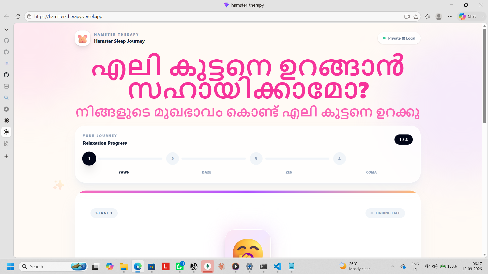
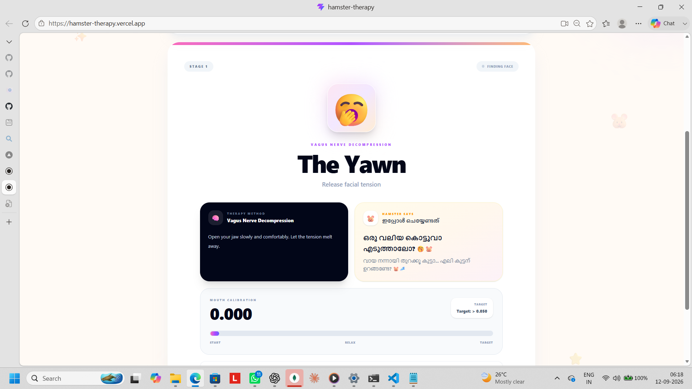
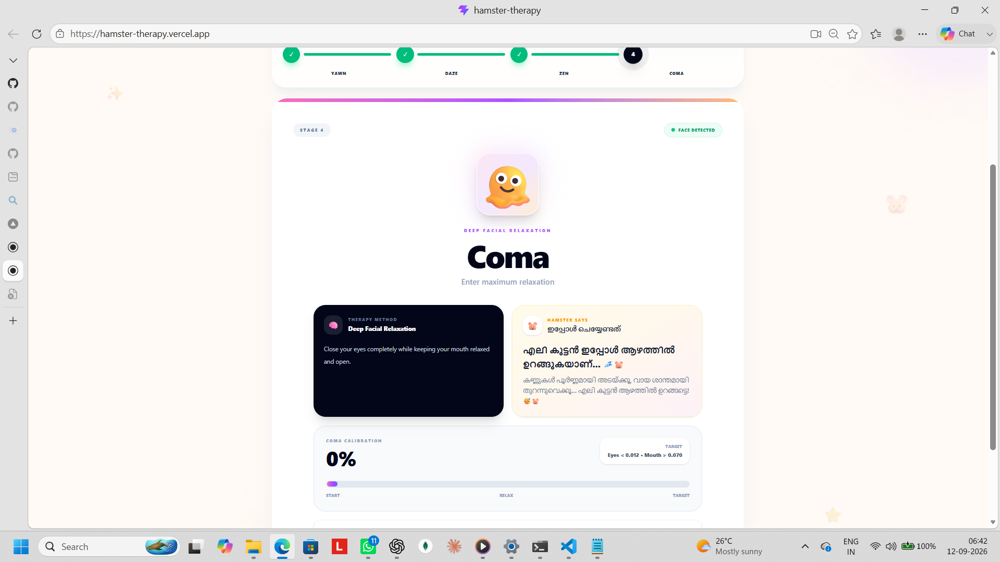
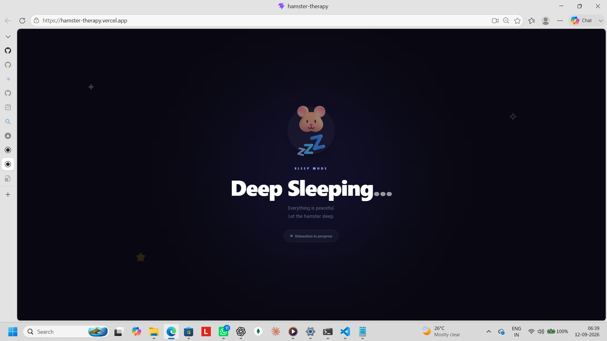
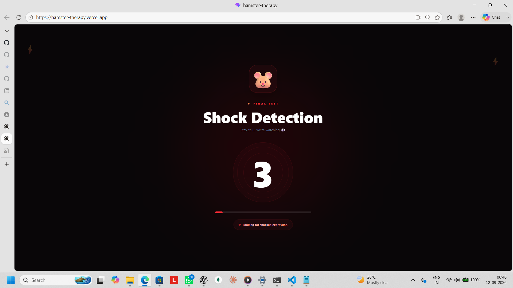
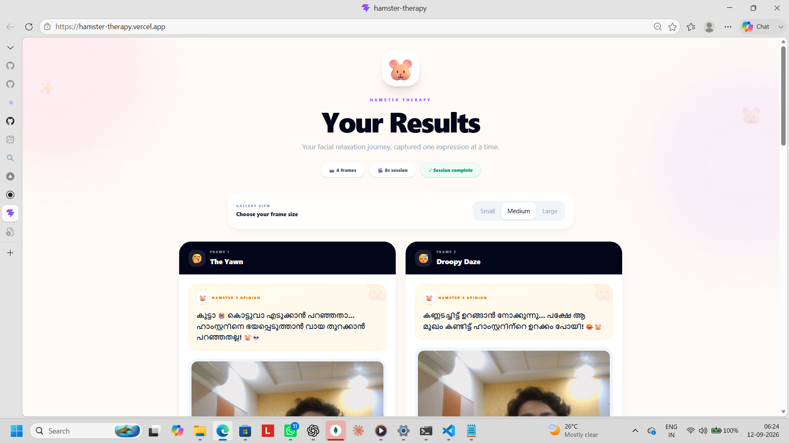
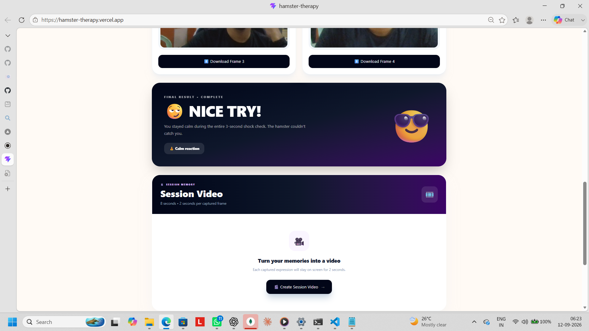
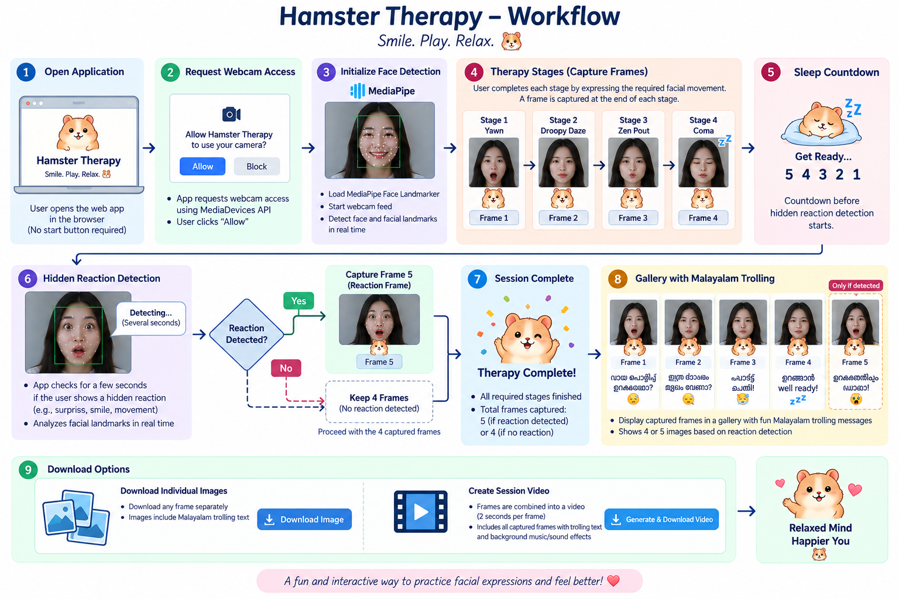

# Hamster Therapy 🐹💤


## Basic Details


### Team Members
- Team Lead: SAURAV B - COLLEGE OF ENGINEERING ATTINGAL


### Project Description

**Hamster Therapy** is a fun web-based therapy experience that uses the webcam and face detection to guide users through different facial-expression exercises. The app captures their expressions and turns them into a funny Malayalam trolling gallery, with an option to create a session video. 🐹😂


### The Problem (that doesn't exist)

Everyone is stressed these days.

There are already hundreds of meditation apps, breathing exercises and sleep apps, but somehow none of them have a hamster judging your facial expressions.

So we decided to solve this very important problem.

Basically, we wanted to find out what happens when you combine a hamster, facial recognition and a little bit of Malayalam trolling. 🐹😂

### The Solution (that nobody asked for)

We made Hamster Therapy.

The app takes the user through four different stages:

**🥱 Yawn → 😴 Droopy Daze → 😗 Zen Pout → 🫠 Coma**

The webcam runs in the background and MediaPipe checks the user's facial landmarks to see whether they are actually doing the expressions.

After finishing all four stages, the app starts a fake sleep sequence. There is also a hidden reaction test at the end. If the user reacts, the app captures that moment and adds it to the final gallery.

The best part is the Malayalam trolling messages that appear with each captured photo. 😂

The captured images can also be downloaded individually or combined into a session video.

## Technical Details
### Technologies/Components Used
For Software:
- **Languages:** TypeScript, JavaScript, HTML, CSS
- **Frameworks:** React 19
- **Libraries:** MediaPipe Tasks Vision, Tailwind CSS
- **Tools:** Vite, npm, Git, GitHub, Vercel
- **Browser APIs:** MediaDevices/WebRTC, Canvas, MediaRecorder, Web Audio, Session Storage

### Implementation
For Software:
# Installation
```bash
git clone https://github.com/Aurenox/hamster-therapy.git
cd hamster-therapy/hamster-therapy
npm install
```
# Run
```bash
npm run dev
```
### Project Documentation
For Software:

# Screenshots


*Hamster Therapy home screen where the user begins the facial-expression therapy experience.*


*Stage 1 — The Yawn, where the application detects the user's facial expression.*


*Stage 4 — Coma, the final facial-expression stage of the therapy journey.*


*The deep-sleep stage that appears after completing all four therapy stages.*


*The hidden reaction-detection stage where the application checks the user's facial expression for a few seconds.*


*The results gallery showing the captured frames with humorous Malayalam trolling messages and individual download options.*


*The session video section where the captured frames can be combined into a video and downloaded.*

# Diagrams


**The workflow shows how Hamster Therapy starts with webcam access and face detection, guides the user through four facial-expression therapy stages, captures each frame, checks for a hidden reaction, and displays the final images with Malayalam trolling messages. If a reaction is detected, a fifth frame is added; otherwise, the session contains four frames. Users can download individual images or create and download a session video.**

### Project Demo
# Video
[Add your demo video link here]
*Explain what the video demonstrates*

# Additional Demos
[link](https://drive.google.com/drive/folders/11_Jve1nhdrHCKj3WU795u7fZug6nmeYY?usp=sharing)

## Team Contributions
- SAURAV B : Designed and developed the complete Hamster Therapy project, including the React/TypeScript interface, MediaPipe facial-expression detection, four therapy stages, webcam frame capture, hidden reaction detection, Malayalam trolling gallery, image downloads, session video generation, audio effects, testing, debugging, GitHub setup, and Vercel deployment.

---
Made with ❤️ at TinkerHub Useless Projects 


